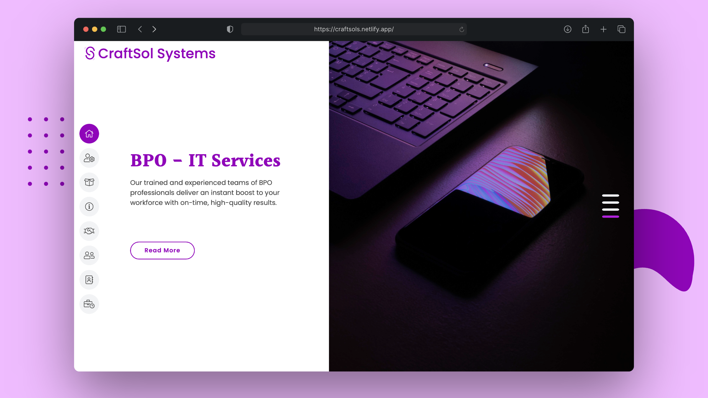

# Craftsol Systems Website

This is the code repository for the Craftsol Systems website, a project developed between August and October 2021. The website provides a detailed overview of the company's IT solutions, allowing users to easily navigate through the provided services.



## Project Demo

A demo of the project is available on YouTube. Follow this link to watch: [Craftsol Systems Website Demo](https://www.youtube.com/watch?v=5fXVmwy9jhs)

## Project Mockup


## Technologies Used

- HTML
- CSS
- JavaScript

## Running the Project

To run the project locally, clone the repository and open the `index.html` file in your preferred browser.

```bash
git clone https://github.com/MSarmadQadeer/craftsols.git
```

Navigate to the project directory and open `index.html`.

## Feedback

If you have any feedback, please open an issue in this repository. We'd love to make improvements based on your suggestions.

## License

This project is licensed under the MIT License - see the [LICENSE](LICENSE) file for details.
